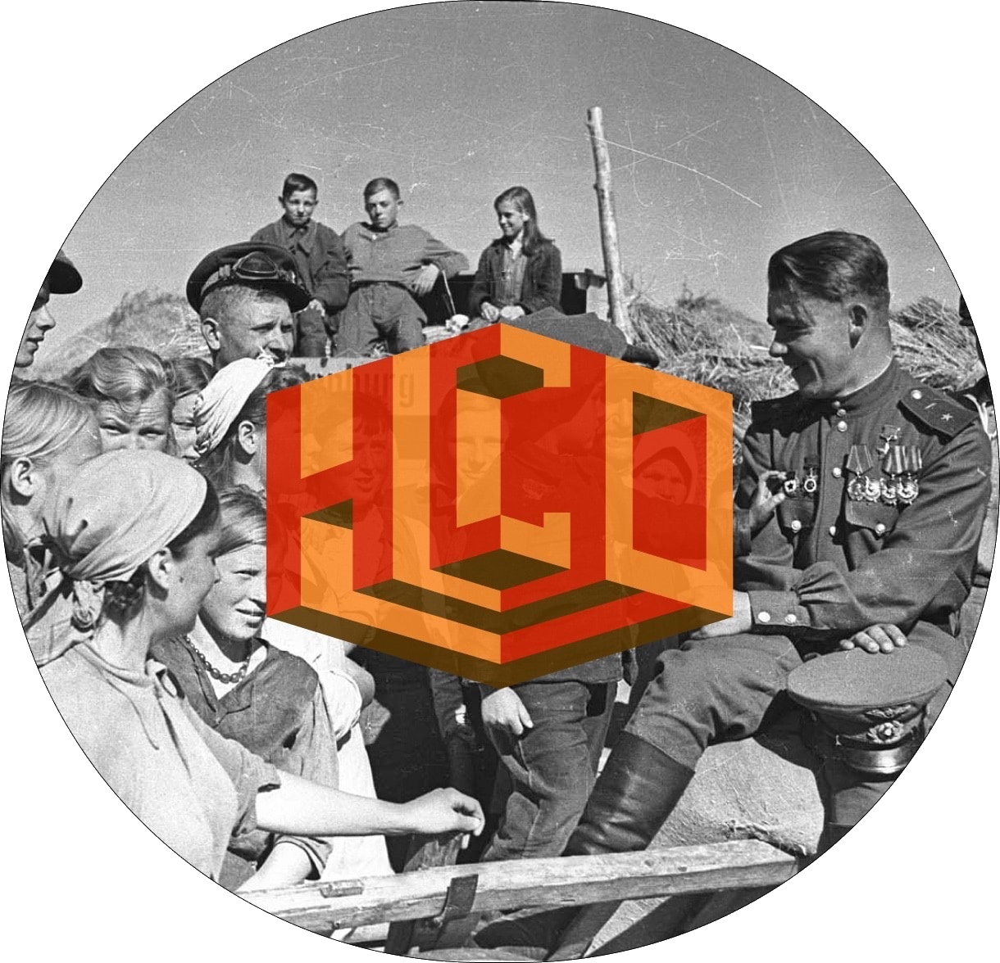

<h2><b>Voice from the Past</b></h2>
<i>Telegram-based historical game about the Soviet victory in World War II</i>

 

## Project documents

Here you can find all project documents, photos, ideas and other content accompanying my project.

The quest was developed during a student trip to a vacation home in the city of Solnechnogorsk.

The prototype for the quest was Wotten, an event created as part of a partnership between the computer game World of Tanks and the Babaevsky chocolate concern. A first-hand description of the event can be found [here](/longread-babaevsky-kvest.pdf).
